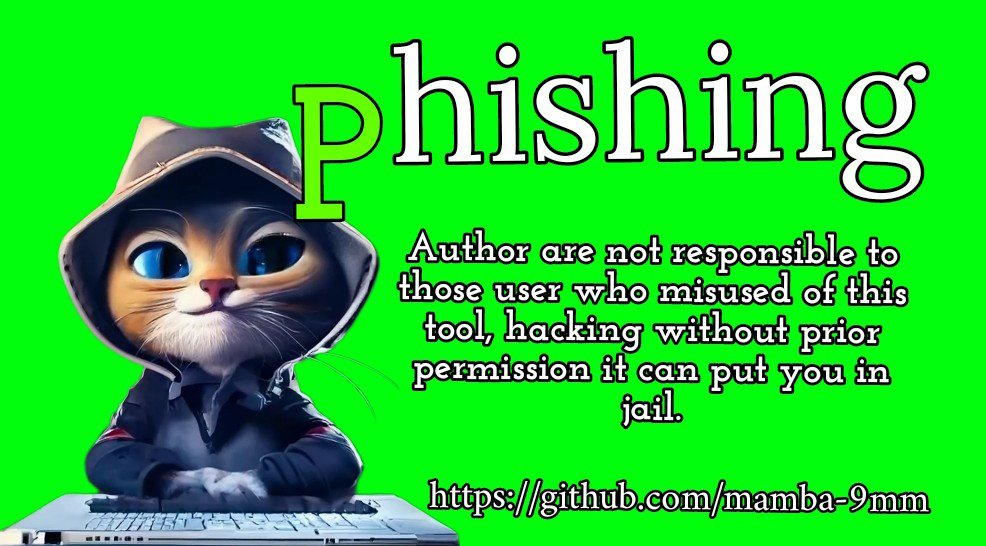

<!-- Phishing -->

<p align="center">
  
</p>

<p align="center">
  
  
  
  
  
</p>

<p align="center">
  
  
  
  
  </a>
</p>

<p align="center"><b>A beginners friendly and Automated trusted phishing tool with 5 templates .</b></p>

##

<h3><p align="center">Disclaimer</p></h3>

<i>User's any actions and activities related to <b>Phishing</b> is solely your responsibility. The misuse of this toolkit can result in <b>criminal charges</b> brought against the persons in question. <b>The author will not be held responsible</b> in the event of any criminal charges be brought against any individuals misusing this toolkit to break the law.

<b>This toolkit contains materials that can be potentially damaging or dangerous for social media user's</b>. Kindly refer to the laws in your province/country before accessing, using, or in  other way of utilizing this in a wrong way.

<b>This Tool is made for educational purposes only</b>. Do not attempt to violate the law with anything contained here. <b>If this is your intention, then author will not be responsible of your actions</b>!

It only demonstrates "how phishing works". <b>You shall not misuse the information to gain unauthorized access to someones social media</b>. However you may try out this at your own risk.</i>

##

### Installation (Termux)
You can easily install phishing in Termux by using the command below
```
$ termux-setup-storage
$ apt update
$ apt upgrade
$ pkg install wget
$ pkg install php
$ pkg install curl
$ pkg install git
$ git clone https://github.com/mamba-9mm/phishing.git
$ cd phishing
$ chmod +x phishing.sh
$ bash phishing.sh
```
### A Note : 
***Termux discourages hacking*** .. So never discuss anything related to *phishing* in any of the termux discussion groups. For more check : [wiki](https://wiki.termux.com/wiki/Hacking)

##

<details>
  <summary><h3>Dependencies</h3></summary>

<b>Phishing</b> requires following programs to run properly - 
- `git`
- `curl`
- `php`

> All the dependencies will be installed automatically when you run **Phishing** for the first time.
</details>

<details>
  <summary><h3>Tested on</h3></summary>

- **Ubuntu**
- **Debian**
- **Arch**
- **Manjaro**
- **Fedora**
- **Termux**
</details>

##

### Find Me on:
<p align="left">
  <a href="https://www.facebook.com/mambamentality9mm?mibextid=ZbWKwL" target="_blank"></a>
     <a href="https://m.me/mambamentality9mm" target="_blank"></a>
  </a>
  <a href="https://github.com/mamba-9mm" target="_blank"></a>
 <a href="https://instagram.com/mamba9mm?igshid=MzMyNGUyNmU2YQ==" target="_blank"></a>
</p>


### * ENJOY USING THE TOOLS ^_^ *


<!-- // -->


